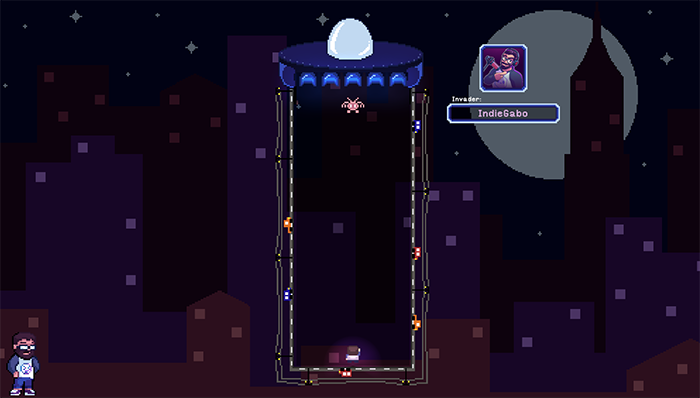

# Chat Invaders

Use comandos para defender o chat do invasor!

# Como funciona

A qualquer momento da live qualquer pessoa pode iniciar o jogo usando o comando `!invadir`. Nesse momento o Gabinho vai solicitar a ajuda do chat para tentar impedir a invasão.

## Objetivos

Para quem invade, o objetivo é fazer um de seus monstrinhos chegarem ao chão. Caso isso aconteça, a invasão é considerada vitoriosa e o chat foi derrotado. Bonificações são aplicadas ao invasor.

Para todas as outras pessoas do chat, o objetivo é fazer o Gabinhozinho se mover estrategicamente para que possa atirar e se livrar dos inimigos e da nave mãe. Caso sejam destrúidas 4 bocas (estruturas de surgimento de inimigos), o chat é considerado vitorioso e todos os participantes recebem bonificação.

## Os turnos

Cada turno consiste de duas etapas: Entrada de dados e execução.

Na etapa de entrada de dados, o chat deve usar os comandos `!ci-esquerda`, `!ci-ficar` ou `!ci-direita` para votar e assim definir o lado para o qual o Gabinhozinho deve se movimentar (ou ficar parado). Essa etapa dura 8 segundos. Tem uma invasão acontecendo... não temos todo tempo do mundo, ora essas.

Após o chat definir a movimentação do Gabinhozinho, o turno é executado. Os eventos acontecem na seguinte ordem:

**1.** A nave mãe escolhe aleatoriamente uma de suas bocas para soltar um laser incapacitante. Caso essa seja a mesma coluna em que o Gabinhozinho está, ele será considerado incapacitado durante o restante da execução do turno e não conseguirá agir. Oh não!

Bocas destrúidas não soltam laser.

**2.** O Gabinhozinho se move para o lado escolhido pelo chat.

**3.** O Gabinhozinho atira na coluna em que está. Seu tiro destrói inimigos e bocas da nave mãe.

**4.** Todos os inimigos se movem uma casa em direção ao chão.

**5.** Novos inimigos surgem das bocas. Quanto mais turnos tiverem passado mais inimigos surgirão. Bocas destruídas não fazem novos inimigos surgirem.

**6.** O turno acaba. É avaliado se um dos objetivos foram alcançados. Em caso positivo, o jogo é encerrado e as bonificações são aplicadas. Em caso negativo um novo turno se inicia.

## O laser de quem invade

Durante a invasão, na etapa de entrada de dados, quem invade pode usar o comando `!ci-laser` uma vez. O efeito desse comando é aplicado na etapa de execução fazendo com que a nave mãe solte o raio pela boca da coluna em que o Gabinhozinho está, fazendo-o certeiro.

Dica para quem invade: Bocas destruídas não soltam laser e você só tem um uso desse poder durante a invasão. Use-o com sabedoria.

# Comandos

> [!WARNING]
> Por conta do sistema anti-spam da twitch, as vezes será necessário revezar comandos para conseguir interagir com o jogo. Por isso alguns comandos possuem múltiplas opções.

## `!invadir`

Usado para iniciar o jogo. Quem usa esse comando se torna a pessoa que invade durante o jogo.

## `!esquerda` | `!esq` | `!<-` | `!left`

Deve ser usado durante a fase de entrada de dados para votar que o Gabinhozinho se mova para esquerda durante a execução.

## `!ficar` | `!fica` | `!-` | `!stay`

Deve ser usado durante a fase de entrada de dados para votar que o Gabinhozinho fique parado durante a execução.

## `!direita` | `!dir` | `!->` | `!right`

Deve ser usado durante a fase de entrada de dados para votar que o Gabinhozinho se mova para direita durante a execução.

## `!laser` | `!poder` | `!power`

Pode ser usado uma única vez por quem invade durante a invasão. Faz com que na fase de execução a nave mãe solte o laser especificamente pela boca da mesma coluna em que o Gabinhozinho se encontra. Lembre-se: Bocas destruídas não soltam laser e o comando é considerado usado.