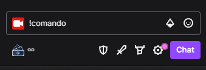

# Sobre

Boas vindas! Aqui você encontra as informações necessárias para participar das lives do Gabo!

Este documento é para informar sobre as possibilidades durante as lives e sobre o possíveis comandos.

# Usando comandos no chat

Cada seção informa sobre seus possíveis comandos de chat. Por exemplo, na seção [Gabinho](./content/gabinho/index.md), além de encontrar informações
sobre o Gabinho, você também encontra a lista de [possíveis comandos](./content/gabinho/index.md#comandos) para interagir com ele.

Um comando pode ser executado através do chat da live, ou através de um [sussurro](https://blog.twitch.tv/en/2015/06/10/psst-hey-you-let-s-whisper-2a84ac496804/) enviado diretamente para a [conta do Gabinho](https://www.twitch.tv/indiegabinho).

> [!CAUTION]
> Comandos enviados através de sussurros para o Gabinho não levam em conta se você possui inscrição no canal ou é VIP. Caso precise que isso seja considerado, utilize o chat do canal.

Comandos só funcionam durante as lives.

## Estrutura de um comando

Um comando é composto por uma palavra de comando que tem uma `!` na frente, como por exemplo `!pular`. Depois da palavra de comando, dependendo do comando, podem existir parâmetros, que podem ser apenas uma palavra identificadora, ou a junção de um identificador com um valor, como `força:15`.

## Exemplo de documentação de comando:

## `!nomedocomando`

Paramêtros:

| Identificador | Tipo | Função |
| ---  | ---  | --- |
| **param1** | - | Descrição do efeito do parâmetro |
| **param2** | Numérico | Valor numérico que deve ser associado ao parâmetro no padrão `param2:30` |
| **param2** | Texto | Valor em texto que deve ser associado ao parâmetro no padrão `param3:texto` |

**Exemplos de uso:**

`!nomedocomando param1` 

`!nomedocomando param2:30` 

`!nomedocomando param3:cima`

E, claro, você pode usar uma combinação de parâmetros:

`!nomedocomando param3:cima param1 param2:15`

A ordem dos parâmetros é irrelevante.
